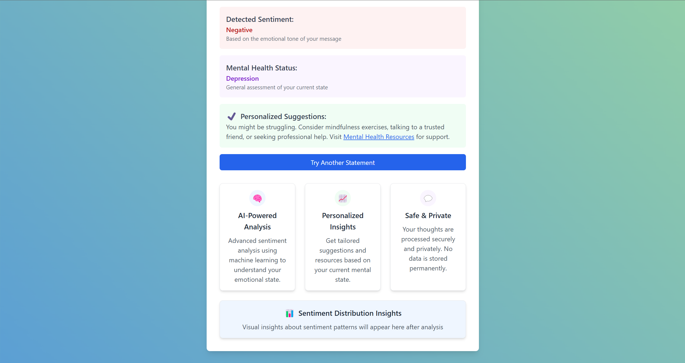

# Mental-Health-Sentiment-Analysis
Mental Health Sentiment Analysis is a web application designed to analyze users' emotional states based on their text input. By leveraging advanced natural language processing (NLP) and machine learning techniques, the application provides insights into users' mental health status and sentiment, along with personalized recommendations for well-being. The project aims to create a safe, private, and accessible platform for individuals to reflect on their emotions.

This application uses a Flask backend to serve a user-friendly web interface, powered by machine learning models trained on a dataset of mental health-related statements. The system employs VADER sentiment analysis and a custom-trained LinearSVC model to classify text into sentiment categories (Positive, Negative, Neutral) and mental health statuses.

## Features

Text Input Analysis: Users can input their thoughts or feelings, which are analyzed for sentiment and mental health status.
VADER Sentiment Analysis: Utilizes the VADER (Valence Aware Dictionary and sEntiment Reasoner) tool to determine the emotional tone of text.
Machine Learning Models: Custom-trained LinearSVC models for both sentiment and mental health status classification.
Data Visualization: Generates a sentiment distribution plot to provide visual insights into the dataset.
Secure and Private: Ensures no permanent storage of user data and employs HIPAA-compliant security measures.
Responsive UI: A modern, user-friendly interface built with HTML, Tailwind CSS, and JavaScript.

## Technologies Used

Backend:
Python 3.8+
Flask (Web framework for serving the application)
Pandas (Data manipulation and analysis)
NLTK (Natural Language Processing)
Scikit-learn (Machine learning models and pipelines)
VADER Sentiment (Sentiment analysis)
Pickle (Model serialization)

Frontend:
HTML5
Tailwind CSS (Styling)

## Dataset

The application uses the Combined_Data.csv dataset, which contains statements and their corresponding mental health statuses. The dataset is processed to clean text, remove missing values, and apply sentiment analysis.

## ⚙️ Requirements

- Python 3.7+
- pandas
- nltk
- scikit-learn
- matplotlib
- seaborn
- vaderSentiment

Install required packages:

```bash
pip install pandas nltk scikit-learn matplotlib seaborn vaderSentiment
```

Also, make sure to download the required NLTK resources:

```python
import nltk
nltk.download('punkt')
nltk.download('stopwords')
```

---





##  How to Run

1. Place your dataset as `Combined_Data.csv` in the root directory. It must include:
   - `statement` column (text data)
   - `status` column (label)

2. Run the script:

```bash
python app.py
```

3. The script will:
   - Clean and preprocess the text
   - Apply VADER sentiment analysis
   - Train two models (`status` and `sentiment`)
   - Evaluate their accuracy
   - Save trained models (`.pkl`)
   - Generate a sentiment distribution plot (`static/sentiment_distribution.png`)

---

## Test with curl

```bash
curl -X POST http://127.0.0.1:5000/predict \
    -H "Content-Type: application/json" \
    -d '{"text": "I feel very anxious and tired lately."}'
```

Example response:
```json
{
  "status_prediction": "Depressed",
  "sentiment_prediction": "Negative"
}
```

## Contributing

Contributions are welcome! Please follow these steps:
Fork the repository.
Create a new branch.
Make your changes and submit a pull request.
Ensure your code follows the existing style and includes appropriate tests.

## License
Public.
